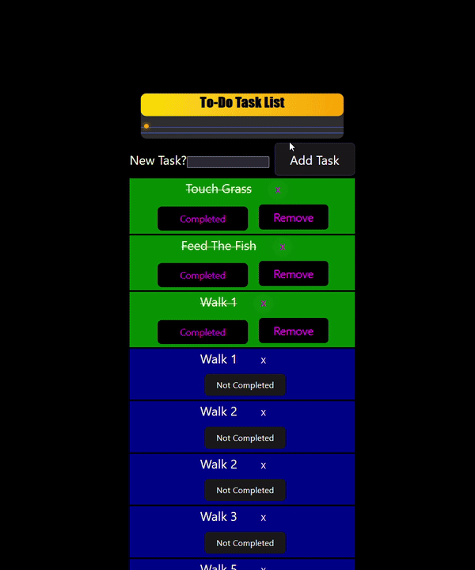

# Todo App - List, Add, Remove Todos

**Demo**

Create a Todo App that allows users to see, add, edit, and remove todos. It should contain the following components.

***App***

this component should render the ***TodoList*** component

***TodoList***

this component should render the ***NewTodoForm*** component and should render the list of Todo components. Place your state that contains all of the todos in this component.

***NewTodoForm***

this component should render a form with one text input for the task to be created. When this form is submitted, a new ***Todo*** component should be created. 

***Todo***

this component should display a ***div*** with the task of the todo.

For each Todo component, there should also be a button with the text “X” that when clicked, removes the todo.

---

## TODO 

### Further Study

---
 - It’s time to edit some todos! Each Todo component should also display a button with the text “edit” that when clicked, displays form with the task of the todo as an input and a button to submit the form. When the form is submitted, the task of the text should be updated and the form should be hidden.

 - When each Todo component is displayed, add a button with the text of “Mark as completed”. When this button is clicked, add a strike through the text of the todo.

 - Instead of a button that when clicked adds a strike through, refactor your application so that when that button is clicked, if the todo is completed (something each todo will have in state), add a strike through, otherwise if a todo is not completed, remove the strike through.

 - Add some styling to your application! Try to use a CSS animation that fades out a Todo when it is deleted (this will involve adding/removing CSS classes). Write this using SASS!

 - Save your todos in localStorage and retrieve them when the page loads.